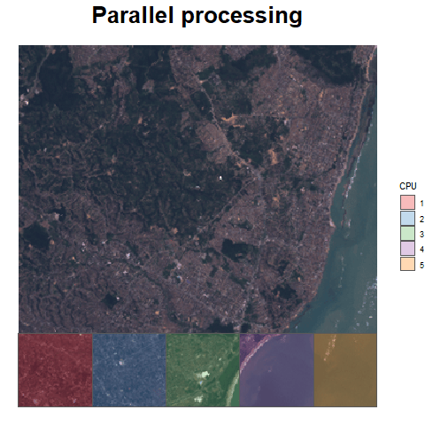

# Parallel raster processing in the {stars} package 

The following tutorial demonstrates the parallel processing of huge (out-of-memory) raster
data in the [**stars**](https://github.com/r-spatial/stars) package. The discussed example
concerns the unsupervised classification of multispectral satellite images. The used technique
allows you to divide the image into smaller blocks and process them simultaneously (rather
than sequentially), so you will notice an increase in performance.

### [Tutorial](https://kadyb.github.io/stars-parallel/Tutorial.html)

